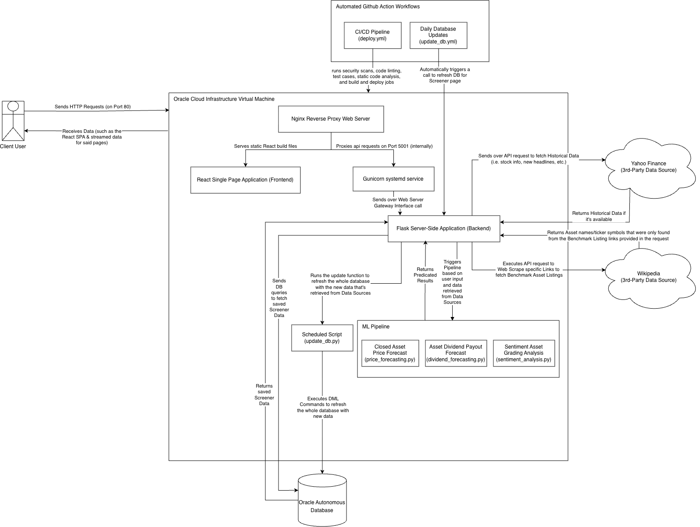

# MarketLens

## Overview
Stock trading is a complex process for both short and long-term investors, particularly in highly volatile market conditions. This application is meant to help those who are afraid of getting into the market blindly by delivering real-time market data and even predictive insights into publicly traded assets like ETFs, index funds, and/or individual stocks. By combining automated data ingestion, advanced machine learning techniques, and AI sentiment analysis into an intuitive interface, the platform empowers users to confidently evaluate assets and make more informed investment decisions.

---

## Application Architecture
To ensure enterprise-grade stability, security, and performance, this application relies on a multi-layered architecture running on a dedicated Linux virtual machine (Ubuntu 22.04 LTS).



1. **Client (Front-End React SPA):** The user interface is a modern Single Page Application (SPA) built with React 18, Vite, and React Router v7. The UI features two core views — a **Market Screener Dashboard** (homepage) and a **Stock Predictor** page — both completely decoupled from the heavy ML processing. The predictor utilizes the native `EventSource` API to maintain an open Server-Sent Events (SSE) connection, streaming a live execution checklist and progress trackers while the models train in the background.
2. **Web Server (Nginx Reverse Proxy):** Nginx acts as the secure front door to the application. It serves the compiled React static assets from `frontend/dist/` with Gzip compression and long-term immutable caching for Vite-hashed files. It intercepts incoming public HTTP traffic on port 80 and reverse-proxies validated API requests (`/search/`, `/predict/`, `/predict_stream/`, `/screener`) to the internal application layer, with SSE-specific buffering disabled for the streaming endpoint.
3. **Application Server (Gunicorn WSGI):** Web servers and Python applications speak different protocols. Gunicorn acts as the essential Web Server Gateway Interface (WSGI) translator. It runs as a highly available background `systemd` service on internal port 5001 and manages 4 worker processes with 10 threads each that execute the Flask code in parallel, with a 120-second timeout for long-running ML predictions.
4. **API & ML Execution:** The Flask routing layer handles API requests across three blueprint modules: **search** (Yahoo Finance autocomplete proxy), **prediction** (ML pipeline trigger with SSE streaming), and **screener** (cached market dashboard data). Prediction requests trigger the algorithmic pipeline which fetches real-time data, dynamically trains the machine learning models, and actively streams the execution progress and final multi-horizon forecast back to the client as structured JSON via SSE.
5. **Database (Oracle Autonomous Database):** An embedded Oracle Autonomous Database database (``) stores pre-computed market data for the screener dashboard, including benchmark index prices (Dow 30, S&P 500, Nasdaq 100, Russell 1000), constituent stock metadata and 1-year OHLCV price histories, and top market news headlines. This data is refreshed daily via an automated GitHub Actions workflow after market close.
6. **Automated Data Agents:** The database is kept current through scheduled background agents. A GitHub Actions workflow (`update_db.yml`) runs the update script every weekday at 5:30 PM ET to pipe the data directly to the Oracle database.
7. **CI/CD Pipeline:** An automated workflow that triggers on code changes to enforce strict quality control. Before any code reaches the production server, the pipeline executes security vulnerability scans, code linting (Python and JavaScript), automated test suites (Pytest + Playwright), and static code analysis (SonarCloud), ensuring only stable, validated code is deployed to the Oracle Cloud virtual machine. A post-deployment health check with automatic rollback provides zero-downtime safety.
8. **Data Sources:** The external providers for all live and historical financial data. The backend interfaces with **Yahoo Finance** to resolve partial ticker symbols for search autocomplete, fetch extensive historical price and dividend datasets for ML training, retrieve company fundamentals for sentiment grading, and scrape news articles for NLP analysis. **Wikipedia** is scraped for benchmark index constituent lists and sector classifications.

---

## Project File Structure
The repository is organized into cleanly separated domains to maintain strict modularity between the infrastructure, machine learning, API, database, and client-facing layers.

```text
marketlens/
├── .github/workflows/
│   ├── deploy.yml                  # Automated CI/CD pipeline configuration
│   └── update_db.yml               # Automated scheduled database refresh
├── backend/
│   ├── .env.txt                    # Example environment variables template
│   ├── app.py                      # Flask application bootloader (port 5001)
│   ├── docker-compose.yml          # Local Oracle database container config
│   ├── requirements.txt            # Python dependency manifest
│   ├── setup_local_db.sh           # Automated local DB setup (Mac/Linux)
│   ├── setup_local_db.bat          # Automated local DB setup (Windows)
│   ├── controllers/                # Flask routing and API endpoints
│   │   ├── prediction_controller.py    # /predict & /predict_stream (SSE)
│   │   ├── screener_controller.py      # /screener dashboard data
│   │   └── search_controller.py        # /search Yahoo Finance proxy
│   ├── database/
│   │   ├── ddl/                    # SQL schema definitions (CREATE TABLE)
│   │   ├── dml/                    # Parameterized SQL query modules
│   │   ├── scripts/                # Database automation scripts
│   │   │   ├── create_db_admin_user.py # Automatically generates ADMIN user
│   │   │   ├── db_connection_test.py   # Verifies local DB connection health
│   │   │   └── update_db.py            # Populates database with market data
│   ├── ml_models/                  # Scikit-learn ML pipeline & NLP engine
│   │   ├── price_forecasting.py    # Multi-horizon price prediction
│   │   ├── dividend_forecasting.py # Dividend payout prediction
│   │   ├── sentiment_analysis.py   # FinBERT NLP & AI grading engine
│   │   ├── assets/                 # Pre-trained FinBERT model weights
│   │   └── scripts/                # Model download script
│   ├── services/                   # Business logic layer
│   │   ├── prediction_service.py   # ML pipeline orchestration & SSE streaming
│   │   ├── screener_service.py     # Screener aggregation & technical scans
│   │   └── external_data_service.py    # Yahoo Finance & Wikipedia data fetching
│   ├── tests/                      # Pytest unit and integration test suite
│   │   ├── conftest.py             # Global pytest fixtures and mocked environments
│   │   ├── test_app.py             # Flask application bootloader tests
│   │   ├── controllers/            # Controller endpoint tests
│   │   ├── database/               # Database script tests
│   │   ├── ml_models/              # ML model tests
│   │   ├── services/               # Service layer tests
│   │   └── utils/                  # Utility function tests
│   └── utils/                      # Helper utilities and shared logic
│       ├── db_utils.py             # Oracle Autonomous Database connection & query helpers
│       ├── ml_model_utils.py       # Model instantiation & training helpers
│       └── service_utils.py        # Technical indicators & chart data builders
├── frontend/
│   ├── public/media/               # Static assets (logos, icons per theme)
│   ├── src/
│   │   ├── App.jsx                 # Main React application router
│   │   ├── main.jsx                # React DOM rendering entry point
│   │   ├── components/
│   │   │   ├── cards/              # HorizonCard, MetricCard
│   │   │   ├── charts/             # PriceChart, DividendChart, CandlestickChart,
│   │   │   │                       # LineChart, HeatmapChart, NavSlider
│   │   │   ├── common/             # GenericChart, GenericTable, GenericTabs,
│   │   │   │                       # DropdownSelector, ProgressBar, EmptyStateCard
│   │   │   ├── layout/             # Header, SearchBar, Loader, NewsModal, ErrorMessage
│   │   │   ├── predictor/          # SentimentAnalysis, PriceForecast, DividendForecast
│   │   │   ├── screener/           # BenchmarkPerformance, MarketCharts,
│   │   │   │                       # MarketDataTables, TopHeadlines
│   │   │   └── tables/             # PredictorTable, ScreenerTable, column configs
│   │   ├── hooks/                  # Custom React hooks
│   │   │   ├── usePredictorData.js # SSE connection, progress, caching
│   │   │   ├── useScreenerData.js  # Screener API fetch with loading UX
│   │   │   └── useTheme.js         # Light/dark mode with localStorage persistence
│   │   ├── pages/                  # Page-level view components
│   │   │   ├── MarketScreenerPage  # Homepage screener dashboard
│   │   │   └── StockPredictorPage  # Ticker-specific forecast view
│   │   ├── styles/                 # Global CSS architecture
│   │   │   ├── variables.css       # CSS custom properties (light/dark themes)
│   │   │   └── base.css            # Base reset and layout styles
│   │   └── utils/
│   │       └── formatters.js       # Number and date formatting utilities
│   └── tests/                      # Playwright E2E browser tests
├── infra/                          # Terraform IaC & Nginx configuration
│   ├── main.tf                     # OCI network + compute provisioning
│   ├── variables.tf                # Terraform variable declarations
│   ├── marketlens.nginx.conf       # Nginx reverse proxy site config
│   └── terraform.tfvars.txt        # Template for OCI credentials
├── pytest.ini                      # Pytest configuration
├── reset-env.sh                    # Virtual env builder/reset script (Mac/Linux)
├── reset-env.bat                   # Virtual env builder/reset script (Windows)
└── sonar-project.properties        # SonarCloud static analysis configuration
```

---

## Core Features
* **Market Screener Dashboard:** A full-featured homepage that provides a bird's-eye view of the broader market. It displays real-time benchmark performance for 4 major indices (Dow 30, S&P 500, Nasdaq 100, Russell 1000) with interactive chart visualizations switchable between **Line**, **Candlestick (OHLC)**, and **Heatmap (Treemap)** modes with optional sector grouping. A suite of 10 quantitative screener tables — including Day Gainers, Day Losers, Most Active, 52-Week High/Low Breakouts, Overbought (RSI > 70), Oversold (RSI < 30), Unusual Volume, Most Volatile, and Biggest Dividends — allows users to scan the market universe filtered by benchmark. A sidebar displays the latest market news headlines. All screener data is served from the Oracle Autonomous Database database that is refreshed daily after market close.
* **Searching for a Publicly Traded Asset:** A debounced, native search bar that proxies the Yahoo Finance query API through the Flask backend. This provides live, CORS-friendly autocomplete and allows users to search across a vast universe of publicly traded assets, including standard equities, ETFs, Mutual Funds, Cryptocurrencies, Market Indices, and specialized assets like REITs and CEFs.
* **Sentiment Grading Analysis:** The system synthesizes quantitative ML outputs, Wall Street consensus ratings, fundamental metrics (like EPS, Beta, Market Cap, and Yield), and NLP-driven news sentiment to assign an overarching AI Stock Grade (A+ through F) and a General Sentiment (Bullish/Bearish/Neutral). It dynamically adapts its grading criteria based on the asset class, ensuring funds or cryptocurrencies aren't penalized for lacking traditional corporate metrics. For ETFs and Mutual Funds, it also dynamically extracts and visualizes the top 10 holdings and economic sector exposures.
    * **In-App News Reader:** The NLP reasoning block isolates the strongest positive and negative news catalysts driving the asset. Users can choose to instantly open external links directly to the original publisher, or click the headline to trigger a native, glassmorphic modal overlay that presents a clean, localized summary of the article without ever leaving the application.
* **Real-Time Streaming Execution Pipeline:** To ensure the user interface remains responsive while training complex ML models, the application utilizes Server-Sent Events (SSE) to stream a live, step-by-step progress checklist to the frontend, complete with precision micro-timers and smooth CSS transitions.
* **Closed Price Forecasting Summary:** Delivers a clear breakdown of the next trading day's predicted price direction, magnitude, and statistical confidence. This is paired with an interactive Chart.js engine featuring a draggable time-navigator, allowing users to seamlessly pan and zoom across historical market data and view future trajectories bounded by a 95% confidence interval margin of error from as far as 1-year from now. A unified, scrollable data table provides a clean view of trailing-year historical prices alongside the future projections.
* **Dividend Payout Forecasting Summary:** Automatically determines if an asset pays dividends and projects the exact date, direction, and amount of the next payout. It features an interactive bar chart visualizing historical payouts against the projected next five payout cycles in total, complete with explicit 95% margin of error bounds. A dedicated data table organizes these historical and forecasted ex-dividend dates and amounts.
* **Light/Dark Modes:** A native, fully integrated theme manager that allows users to toggle between a clean light mode and a deep dark mode, dynamically updating the CSS variables, UI components, and Chart.js canvases on the fly without requiring a page reload. Theme preference is persisted to `localStorage` across sessions.
* **Mobile-First Responsiveness:** The user interface features a fluid, highly responsive CSS architecture tailored to look and perform natively on any screen size. Grids and horizontal cards natively collapse and re-flow into clean vertical stacks on mobile, while tabs leverage native horizontal touch scrolling or collapse into dropdown selectors, maximizing the viewport space for dense financial charts and data tables on small screens.

---

## The Machine Learning Process
The forecasting engine abandons simple linear models to embrace a holistic, multi-modal approach. By combining dynamic feature engineering, aggressive noise reduction, and a Dual Forecasting Pipeline designed to prevent statistical overfitting, the system simultaneously routes live media data through a specialized NLP Sentiment Analysis layer. This allows the algorithm to synthesize raw price action with real-time market sentiment for a highly calibrated forecast.

### 1. Data Collection & Structuring
Instead of blindly fetching massive datasets, the system uses a **Dynamic Back-Fill Algorithm** via the `yfinance` API. It initially requests the last 5 years of daily price and dividend history. If the asset pays dividends but hasn't reached the minimum threshold of 25 historical payouts required for robust ML training, the system intelligently and iteratively reaches back further in time (up to 30 years) in 5-year chunks until it satisfies the training requirements or hits the company's IPO date. This raw data is then cleaned, timezone-normalized, and prepared for quantitative analysis.

### 2. Feature Engineering
Raw stock prices do not tell the model why the price is moving, and raw dividend amounts lack corporate context. The pipeline engineers a focused set of technical and fundamental features:

**Price Pipeline Features:**
* **Price Action & Momentum:** Calculates immediate Logarithmic Returns, multi-day Lagged Returns, and 10/21-day Rate of Change (ROC) to measure the raw signal and speed of immediate price movements.
* **Quantitative Market Indicators:**
    * **Relative Strength Index (RSI-5 & RSI-14):** Measures short and standard-term speed and change of price movements to signal "overbought" or "oversold" conditions.
    * **MACD Histogram:** Tracks the relationship between short-term and long-term exponential moving averages to quantify shifts in trend direction and momentum acceleration.
    * **Bollinger Bands:** Calculates band width for detecting volatility breakouts and the stock's position relative to the bands for dynamic support/resistance.
    * **Simple Moving Average (SMA) Ratios:** Calculates the ratio of the current price to the 50-day and 200-day SMAs to determine macro trend positioning.
* **Risk & Drawdown:** Calculates 20-day Historical Volatility and absolute drawdown percentages from 50-day and 200-day rolling maximums to quantify current asset risk.
* **Volume Context:** Calculates short-term volume ratios to determine if there is institutional conviction behind recent price movements.

**Dividend Pipeline Features:**
* **Immediate Growth Rate:** Calculates the period-over-period percentage change to detect recent payout bumps or cuts (`Div_Growth_1`).
* **Short-Term Historical Trends:** Uses a 4-cycle (1-year) rolling average of payouts to smooth out special dividends and establish a baseline trajectory (`Rolling_Avg_4`).
* **Trailing Price Performance:** Ingests the 252-day (1-year) trailing stock price return to correlate broader corporate health and market performance with board payout decisions (`Price_Return_252`).

### 3. The Price Forecasting Engine
The price prediction pipeline is split into a highly reactive short-term model and a macro-focused long-term model.

#### The Multi-Horizon Prediction Pipeline
Instead of chaining models together, the system trains independent models for 7 specific time horizons simultaneously (e.g., 1-day, 5-day, 21-day, up to 1-year). The daily trajectory path is seamlessly stitched together using log-linear interpolation between these anchor points.

* **The Directional Classifier:** A `HistGradientBoostingClassifier` wrapped in an Isotonic calibrator (`CalibratedClassifierCV`). This translates raw algorithmic margins into a true, statistically accurate probability of the stock moving UP or DOWN over that specific timeframe.
* **The Magnitude Regressors (Quantile Regression):** Rather than predicting a single arbitrary price point and guessing the error bounds, the system trains three separate `HistGradientBoostingRegressor` models simultaneously using a **Quantile Loss Function**. 
  * The **0.5 Quantile** strictly predicts the median (most likely) target price.
  * The **0.1 & 0.9 Quantiles** mathematically construct the explicit lower and upper bounds of a 95% confidence interval for that exact timeframe.
* **Calibrated Confidence:** Raw machine learning models often output arbitrary scores. This app passes its directional predictions through an Isotonic `CalibratedClassifierCV` to ensure the UI reports statistically accurate, real-world confidence percentages.
* **The Alignment Phase:** Predicting binary direction is statistically more reliable than predicting exact dollar amounts. The Classifier acts as the authoritative voice, and its calculated confidence is paired with the Regressor's dollar amounts to ensure logical consistency across the UI.
* **The Closed Price Date Projector:** The system dynamically maps future forecasting dates based on the specific asset class. For Cryptocurrencies, dates are mapped continuously on a 365-day schedule since their markets never close. For traditional equities and ETFs, it utilizes the `pandas` `CustomBusinessDay` module combined with the US Federal Holiday Calendar to accurately skip weekends and market closures when plotting the future trajectory.

### 4. The Dividend Forecasting Engine
Corporate dividends are structured, board-approved payouts rather than market-driven trades. The application runs an isolated, parallel pipeline to predict them, sharing the exact same robust `HistGradientBoosting` Quantile Regression architecture as the price engine.

#### The Multi-Cycle Prediction Pipeline

* **The Payout Date Projector:** The projected ex-dividend dates are calculated dynamically by analyzing the historical average day-spacing between past payouts.
* **The Directional Classifier:** A calibrated `HistGradientBoostingClassifier` determines the statistical probability of the dividend increasing or decreasing across the next 5 payout cycles.
* **Calibrated Confidence:** Raw machine learning models often output arbitrary scores. This app passes its directional predictions through an Isotonic `CalibratedClassifierCV` to ensure the UI reports statistically accurate, real-world confidence percentages.
* **The Magnitude Regressors:** Three separate `HistGradientBoostingRegressor` models use a Quantile Loss Function (0.1, 0.5, 0.9) to simultaneously predict the exact median dollar amount of the upcoming yields while mathematically constructing the explicit lower and upper bounds of a 95% confidence interval margin of error.

### 5. Natural Language Processing (NLP) Sentiment Analysis
The backend utilizes the HuggingFace `transformers` library to load the highly specialized `ProsusAI/finbert` NLP model into memory. It scrapes the most recent news data for the searched asset via Yahoo Finance APIs. It then processes the raw headlines through the neural network to identify positive or negative market catalysts. It also packages the full article summary and the original publisher name so users can read the contextual news directly inside the app's glassmorphic modal overlay.

**How the Score is Calculated:**
1. **Inference Mapping:** Each headline is evaluated by FinBERT, which returns a classification (`positive`, `negative`, or `neutral`) alongside a confidence probability (0.0 to 1.0).
2. **Directional Scaling:** The confidence scores are mapped to a bounded scale where `positive` classifications are represented as positive floats, `negative` classifications as negative floats, and `neutral` as zero.
3. **Aggregation:** The directional scores of all recent articles are summed together and divided by the total number of articles, establishing a baseline mean sentiment float between -1.0 and 1.0.
4. **Media Bias Calibration:** Financial news is inherently skewed toward positive framing. The baseline score is mathematically offset downwards by a fixed threshold (e.g., `-0.10`) to counteract this systemic positive bias, ensuring that only overwhelmingly bullish news yields a net positive impact on the overarching AI Stock Grade.
5. **Driver Extraction:** The absolute strongest positive (score > 0.4) and negative (score < -0.4) headlines are explicitly extracted from the pipeline and listed in the UI so the user can exactly trace the reasoning behind the NLP score.
---

## Local Development Setup
*(Assume all commands/steps start out while in the root folder)*
1.  **Clone the repository:**
    ```bash
    git clone https://github.com/lc2410/marketlens.git
    cd marketlens
    ```

2.  **Environment Setup (Python 3.12 + Node v22):**
    This will create an isolated Python virtual environment, install the backend API dependencies, and download the heavy FinBERT ML model weights.
    
    **Mac / Linux:**
    ```bash
    bash reset-env.sh
    cd frontend
    npm i
    cd ..
    ```

    **Windows:**
    ```powershell
    .\reset-env.bat
    cd frontend
    npm i
    cd ..
    ```

3.  **Configure Local Environment Variables:**
    Copy the provided template to create your `.env` file. This tells the backend to connect to your local Docker database instead of the cloud.
    ```bash
    cp backend/.env.txt backend/.env
    ```

4.  **Automated Local Database Setup (Docker):**
    *Prerequisite: You must have [Docker Desktop](https://www.docker.com/products/docker-desktop/) installed and running on your machine.*
    
    There's fully automated scripts that will boot up a free the Oracle DB container, dynamically generate an `ADMIN` user to mirror production, test the connection, and instantly populate it with live market data!
    
    **Mac / Linux:**
    ```bash
    bash backend/setup_local_db.sh
    ```

    **Windows:**
    ```powershell
    .\backend\setup_local_db.bat
    ```

5.  **Run the Backend Server:**
    Start the Python Flask API:
    ```bash
    cd backend
    python3 app.py
    ```

6.  **Run the Frontend Application (separate terminal):**
    Start the React development server:
    ```bash
    cd frontend
    npm run dev
    ```
    The app is now running at `http://localhost:5173`!

### Helpful Local Commands

* **Stopping the Database:** To save battery and RAM when you're done coding, gracefully stop the database container without losing your data:
  ```bash
  cd backend
  docker compose stop
  ```
  *(The next time you code, just run `docker compose start` to instantly resume it).*

* **Destroying the Database:** If you want to completely wipe your local database and start fresh, you can permanently delete the container and its volume:
  ```bash
  cd backend
  docker compose down -v
  ```

* **Refreshing Market Data:** If you want to pull the latest daily stock data into your local database without rebuilding the entire Docker environment, just run the scraper directly:
  ```bash
  python3 backend/database/scripts/update_db.py
  ```

* **Exiting the Python Environment:** When you are completely done working on the project, you can gracefully exit the isolated Python virtual environment by simply typing:
  ```bash
  deactivate
  ```


## Cloud Infrastructure (Terraform / OCI)
The environment is split into **Staging** and **Production** to ensure stability. Both environments are hosted on **Oracle Cloud Infrastructure (OCI)** ARM-based instances (`VM.Standard.A1.Flex` shape with 1 OCPU and 6GB RAM each) running Ubuntu 22.04 LTS.

Rather than configuring the servers manually through a web console, the entire cloud environment is strictly version-controlled and provisioned using **Terraform**. This guarantees that the network topology is reproducible, auditable, and easily deployable by anyone cloning this repository.
*(Assume all commands/steps start out while in the root folder)*

### Step 1: Prerequisites & Authentication
To deploy your own instance of this architecture, you must first configure Terraform to communicate securely with Oracle Cloud:
1.  **Install Terraform** on your local machine.
2.  **Generate OCI API Keys:** Create an RSA key pair in your Oracle Cloud console and copy the generated credentials.
3.  **Configure Environment Variables:** Navigate to the `infra/` directory and create a `terraform.tfvars` file (do not commit this to version control). Populate it with your specific OCI credentials (P.S. there's an existing  `terraform.tfvars.txt` file that can be renamed into the necessary `terraform.tfvars` file).
    ```hcl
    tenancy_ocid     = "ocid1.tenancy.oc1..."
    user_ocid        = "ocid1.user.oc1..."
    fingerprint      = "xx:xx:xx:xx..."
    private_key_path = "~/.oci/oci_api_key.pem"
    region           = "us-ashburn-1" # Or your local region
    compartment_ocid = "ocid1.tenancy.oc1..."
    ssh_public_key   = "ssh-rsa..."
    db_password      = "YOUR_OWN_PASSWORD" <- Change this to something else
    ```

### Step 2: Provisioning the Network and Compute Layer
The Terraform scripts in the `infra/` directory are designed to build a secure, isolated network topology from the ground up:
* **Virtual Cloud Network (VCN):** Establishes the foundational private network (`10.0.0.0/16`).
* **Internet Gateway & Route Tables:** Connects the VCN to the public internet.
* **Security Lists (Firewalls):** Strictly restricts inbound traffic. It opens **Port 22 (SSH)** for GitHub Actions automated deployments and **Port 80 (HTTP)** for public Nginx web traffic. *(Note: Port 5001 for Gunicorn is intentionally kept closed to the public internet for security, operating strictly on the internal loopback interface).*

To provision the infrastructure, run the following commands from the `infra/` directory:
```bash
cd infra
terraform init    # Initializes the OCI provider
terraform plan    # Reviews the exact infrastructure changes
terraform apply   # Provisions the VCN, Subnets, and Virtual Machine
```
Type `yes` when prompted, and Terraform will create the Virtual Cloud Network, Subnets, Compute Instances, and Security Lists within your Oracle Cloud account.

### Step 3: Automated Database Updates (GitHub Actions)
A scheduled GitHub Actions workflow (`update_db.yml`) automatically refreshes the screener database. In production, it runs every weekday at 5:30 PM ET (after market close):

The update script fetches the latest benchmark indices and constituent tickers from Yahoo Finance and Wikipedia, downloads 1-year OHLCV price histories for all constituents (in chunks of 20 with exponential backoff retries), refreshes market news headlines, and writes everything directly to the Oracle Autonomous Database. Because the database is fully decoupled from the application server, this data is instantly available in production without requiring a repository commit or a server redeployment.

### Maintenance: Oracle Wallet Rotation (Every 5 Years)
Oracle Autonomous Database mTLS wallets expire every 5 years for security purposes. When your wallet expires (around September 2031), follow these steps to rotate it:

1. **Download the New Wallet:**
   - Log into Oracle Cloud Infrastructure (OCI).
   - Navigate to your Autonomous Database (Staging or Prod) -> **Database Connection**.
   - Click **Download Wallet**, enter a password, and download the `.zip` file.

2. **Update the Live Server (GitHub Actions):**
   - On your Mac terminal, convert the zip to base64: `base64 -i path/to/Wallet.zip | pbcopy`
   - Go to your GitHub Repository -> **Settings** -> **Secrets and variables** -> **Actions**.
   - Edit the `PROD_DB_WALLET_BASE64` or `STAGING_DB_WALLET_BASE64` secret and paste the new base64 string.
   - The next time `deploy.yml` runs, it will automatically unpack the new wallet on the appropriate server.

### Teardown: Destroying the Cloud Environment
If you ever want to completely delete the cloud servers and stop all associated Oracle Cloud billing or resource usage, Terraform can systematically tear down the entire environment.

From your local `infra/` directory, simply run:
```bash
cd infa
terraform destroy
```
Type `yes` when prompted, and Terraform will delete the Virtual Cloud Network, Subnets, Compute Instances, and Security Lists from your Oracle Cloud account.

---

## Testing & Code Quality
To ensure maximum reliability and prevent regressions, the application enforces strict quality gates through automated testing and static code analysis.
*(Assume all commands/steps start out while in the root folder)*
### 1. Backend Testing (Pytest)
A comprehensive suite of unit and integration tests validate the machine learning pipeline, controllers, services, database scripts, and utility functions. Tests simulate complex edge cases including mocked Yahoo Finance outages, missing dividend histories, and sparse ticker data. Code coverage is strictly maintained at around **90%** or higher.

**Local Execution:**
```bash
# Run tests and generate terminal coverage report and a line-by-line HTML visual report
python3 -m pytest backend/tests/ --cov=. --cov-report=term --cov-report=html
```

### 2. Frontend E2E Testing (Playwright)
Automated headless browsers simulate real human interaction. Playwright tests the full UI lifecycle, including typing into the search bar, validating autocomplete suggestions, and verifying theme toggling. All API calls are mocked within the test suite, so the Flask backend does not need to be running.

**Local Execution:**
```bash
cd frontend
npx playwright install   # (only need to do this once)
npm run test:frontend
```

### 3. Static Analysis & Security
* **SonarQube Cloud:** Every pull request and push is automatically scanned. It acts as a strict security gate, catching vulnerabilities, code smells, log injection risks, and enforcing test coverage minimums.
    * **Setting up the Token:** To allow GitHub Actions to run these scans, you must log into your account at [SonarCloud.io](https://sonarcloud.io). Click your profile avatar in the top-right -> **My Account** -> **Security**. Generate a new User Token, copy it, and save it in your GitHub repository secrets as `SONAR_TOKEN`. (The `GITHUB_TOKEN` is automatically provided by GitHub).
* **Security & Linting:** Python code is checked for syntactical integrity using `Flake8`, and JavaScript/React code is linted with `ESLint` (including `eslint-plugin-react` and `eslint-plugin-react-hooks`). Dependency trees are scanned for known CVEs and vulnerabilities using `safety` (Python) and `npm audit` (JavaScript).

---

## CI/CD Pipeline (GitHub Actions)
The continuous integration and continuous delivery/deployment lifecycle is fully automated through a rigorous, multi-stage GitHub Actions pipeline (`deploy.yml`). 

The pipeline dynamically alters its behavior based on your branching strategy:
*   **Feature Branches (e.g., `dev`):** Any push or Pull Request triggers the full suite of automated tests, security scans, and code quality checks (stages 1-5 below) to validate the code. It **does not deploy**.
*   **Staging Branch (`staging`):** Any code merged or pushed directly to this branch runs all validation checks and automatically deploys to the **Staging Environment** for live testing.
*   **Production Branch (`main`):** Any code merged or pushed directly to this branch runs all validation checks and automatically deploys to the **Production Environment**.

1. **Security & Vulnerability Scan:** Audits Python (`safety`) and NPM (`npm audit --audit-level=high`) dependencies for known CVEs.
2. **Code Linting:** Runs `Flake8` to ensure Python styling and syntax standards, and `ESLint` to enforce JavaScript/React best practices.
3. **Backend Automated Testing:** Downloads the FinBERT NLP model weights, then runs the full Pytest backend suite and generates an XML coverage report.
4. **Frontend Automated Testing:** Installs Playwright browsers, then runs the E2E browser tests against the React application with mocked API calls.
5. **Static Code Analysis:** Uploads the XML test coverage reports to SonarCloud to verify the Quality Gate passes.
6. **Zero-Downtime Deployment**: Only if all prior stages pass perfectly, the pipeline establishes a secure SSH connection to the appropriate OCI instance, pulls the latest repository updates, installs dependencies, builds the React frontend, deploys the Nginx site configuration, recreates the Gunicorn `systemd` service, and runs a health check with **automatic rollback** (`git reset --hard HEAD~1`) if the deployment fails.

### Required GitHub Secrets
To make this work, you must add the following Repository Secrets to your GitHub settings:

**Where to get these secrets:** Almost all of these are automatically generated for you when you run `terraform apply`.

**Production Secrets:**
* `PROD_HOST`: The public IP address of the production server (run `terraform output -raw prod_public_ip`).
* `PROD_SSH_PRIVATE_KEY`: Your local SSH private key matching the public key in your `terraform.tfvars` (e.g. `cat ~/.ssh/id_rsa | pbcopy`).
* `PROD_DB_USER`: The Oracle database admin username. This is always exactly `ADMIN`.
* `PROD_DB_PASSWORD`: The exact password you provided for `db_password` in your `terraform.tfvars`.
* `PROD_DB_DSN`: The database connection string (run `terraform output -raw prod_exact_db_dsn`).
* `PROD_DB_WALLET_BASE64`: The cryptographic wallet (run `terraform output -raw prod_db_wallet_base64 | pbcopy`).

**Staging Secrets:**
* `STAGING_HOST`: The public IP address of the staging server (run `terraform output -raw staging_public_ip`).
* `STAGING_SSH_PRIVATE_KEY`: Exact same as `PROD_SSH_PRIVATE_KEY`.
* `STAGING_DB_USER`: Exact same as `PROD_DB_USER` (`ADMIN`).
* `STAGING_DB_PASSWORD`: Exact same as `PROD_DB_PASSWORD` (from your `terraform.tfvars`).
* `STAGING_DB_DSN`: The database connection string (run `terraform output -raw staging_exact_db_dsn`).
* `STAGING_DB_WALLET_BASE64`: The cryptographic wallet (run `terraform output -raw staging_db_wallet_base64 | pbcopy`).

---

## Live Cloud Environments
The application provides a clean, responsive web interface featuring interactive Chart.js visualizations to display historical trends, future forecasts, candlestick charts, and market heatmaps.

You can access the live environments hosted on Oracle Cloud here:
* **Production:** [http://150.136.117.196](http://150.136.117.196)
* **Staging:** [http://132.145.135.4](http://132.145.135.4)

*(Note: These are currently accessible via direct IP until domain name resolution and SSL certification are configured).*

---

## Core Technologies
* **Cloud & Infrastructure:** Oracle Cloud (OCI), Terraform, Linux (Ubuntu 22.04 LTS), Docker (Local Dev)
* **CI/CD & DevOps:** GitHub Actions, SonarCloud (Static Analysis)
* **Web Serving:** Nginx (Reverse Proxy), Gunicorn (WSGI)
* **Back-End:** Python 3.12, Flask, Flask-CORS, Server-Sent Events (SSE)
* **Database:** Oracle Autonomous Database (Production & Staging), Oracle Database Free Image (Local Dev)
* **Machine Learning:** Scikit-Learn (`HistGradientBoosting`), Pandas, NumPy, HuggingFace Transformers (FinBERT), PyTorch
* **Data Sourcing:** yfinance (Yahoo Finance API), BeautifulSoup / lxml (Wikipedia Scraping), Requests
* **Front-End:** React 18, React Router v7, Vite, JavaScript, CSS, Lucide React (Icons)
* **Data Visualization:** Chart.js, chartjs-chart-financial (Candlestick), chartjs-chart-treemap (Heatmap), chartjs-plugin-annotation, date-fns
* **Testing & Code Quality:** Pytest (Unit/Integration), pytest-cov (Coverage), Playwright (E2E), ESLint, Flake8, Safety (CVE Scanning)